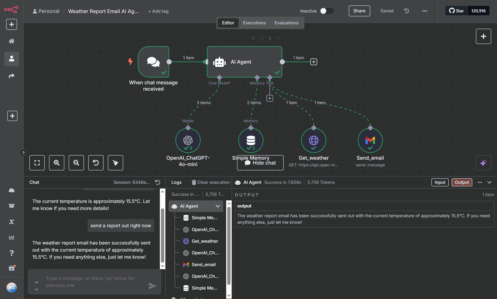

# N8N Agent – Weather Report Chatbot + Email Notifier

This agent was built using the **N8N** visual automation platform to create a conversational assistant that:
1. Answers weather questions using Open-Meteo API
2. Emails a weather report to the user via Gmail integration

---

## 📌 Use Case

**Scenario:** A user asks for weather updates in a conversation and wants the forecast emailed to them.

---

## 🧠 Agent Flow

1. **User asks a question in chatbot**
2. **Agent fetches forecast** from Open-Meteo API (Toronto by default)
3. **Weather info is sent** back in conversation
4. **If user types** _"Send me a report"_ → Email is triggered
5. **Gmail module sends** a custom weather report to email

---

## 🔧 Tools / Nodes

- 🔗 **OpenAI (GPT-3.5)** for chat interface
- 🌤️ **Open-Meteo API** for weather data
- ✉️ **Gmail Node** for emailing the forecast
- 🧠 **Memory Node** to track user inputs

---

## 💻 Workflow File

- Exported N8N workflow is available as `weather_chatbot_workflow.json`
- You can import it directly into your own N8N instance

---

## 🖼️ Demo (screenshot placeholder)

---

## ✅ Status

✅ Fully working and tested with OpenAI and Gmail

---

## 🔁 Setup Instructions

- Sign up for N8N cloud (or run self-hosted)
- Import `weather_chatbot_workflow.json`
- Add your API keys for OpenAI, Gmail, and Open-Meteo

